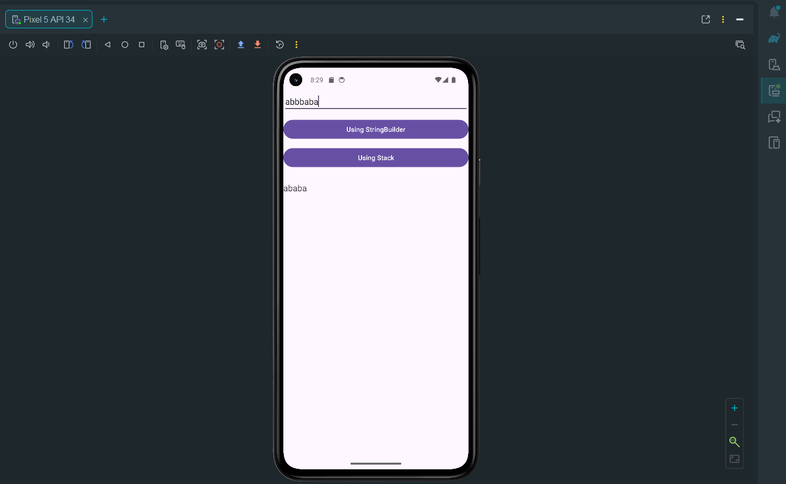

# 🔁 Remove Consecutive Duplicates App

An Android app that removes consecutive duplicate characters from a string using two different approaches: **StringBuilder** and **Stack**.

---

## 🚀 Features
- ✏️ Enter any string  
- 🔄 Remove consecutive duplicate characters  
- ⚡ Two methods:
  - Using StringBuilder  
  - Using Stack  
- 📱 Simple and clean UI  
- 📊 Displays result instantly  

---

## 🖼️ App Preview

  

---

## 🧠 How It Works

### 🔹 Using StringBuilder
- Traverse the string  
- Compare current character with previous  
- Append only if different  

### 🔹 Using Stack
- Push characters into stack  
- Remove duplicates by comparing top element  

---

## 🛠️ Tech Used
- Java / Kotlin  
- Android Studio  
- XML  

---

## 📌 Author
- Mayur Hiware
